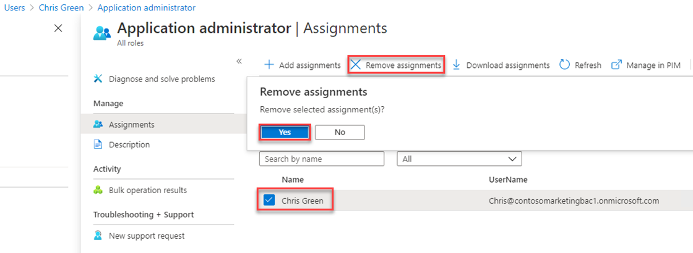

---
lab:
    title: '01 - Manage user roles'
    learning path: '01'
    module: 'Module 01 - Implement an identity management solution'
---

# Lab 01: Manage user roles

## Lab scenario

Your company recently hired a new employee who will perform duties as an application administrator. You must create a new user and assign the appropriate role.

#### Estimated time: 10 minutes

## Create an Azure account and add Azure Active Directory Premium P2 trial licenses

The tasks in this exercise and the exercises in this learning path require you to already have and Azure subscription that you can use or to sign up for an Azure trial account. If you already have your own Azure subscription, you may skip this task and continue to the next.

1. In a web browser, go to [https://azure.microsoft.com/free](https://azure.microsoft.com/free).

1. Scroll down through the page to learn more about the benefits and free services available.

1. Select **Start free**.

1. Use the wizard to sign up for your Azure trial subscription.

1. You will need to an Azure AD P2 license to complete some of the exercises. In the organization you created, search for and then select **Azure Active Directory**.

1. In the left navigation menu, select **Getting started**.

1. Under Getting started with Azure AD, select **Get a free trial for Azure AD Premium**.

1. In the Activate pane, under **AZURE AD PREMIUM P2**, select **Free trial** and then select **Activate**.

1. In the navigation menu on the left, select **Overview**.

1. Refresh the browser until you see Azure AD Premium P2 under the organization name. It may take a couple of minutes.

1. You may need to sign out and sign back into Microsoft Azure if you encounter any problems with expected features not being available.

## Add a new user

Now, let's create a user account.

1. Sign in to the [https://portal.azure.com](https://portal.azure.com) as a Global administrator

1. Search for and then select **Azure Active Directory**.

1. In the left navigation menu, under **Manage**, select **Users > New User**.

1. Create a user using the following information:

    | **Setting**| **Value**|
    | :--- | :--- |
    | User name| Chris|
    | Name| Chris Green|
    | First name| Chris|
    | Last name| Green|
    | Password| Pass@word1|

1. Select **Create**. The user is now created and registered to your organization.

## Assign a role to a user

Using Azure Active Directory (Azure AD), you can designate limited administrators to manage identity tasks in less-privileged roles. Administrators can be assigned for such purposes as adding or changing users, assigning administrative roles, resetting user passwords, managing user licenses, and managing domain names.

1. In Azure Active Directory, All users blade, select **Chris Green**.

1. On the **user’s profile** page, select **Assigned roles**. The **Assigned roles** page appears.

1. Select **Add assignments**, select the **Application administrator** role and then select **Add**.

    

The newly assigned Application administrator role appears on the user’s **Assigned roles** page.

## Remove a role assignment

If you need to remove the role assignment from a user, you can also do that from the **Assigned roles** page.

1. In **Azure Active Directory**, select **Users**, and then select the user getting the role assignment removed. For example, *Chris Green*.

1. Select **Assigned roles**, select the name of the role your wish to removed.

1. Select the check box for the user who will be removed from the role, and then select **Remove assignments**.

    

The Application administrator role is removed from the user and it no longer appears on the **Alain Charon – Assigned roles** page.

