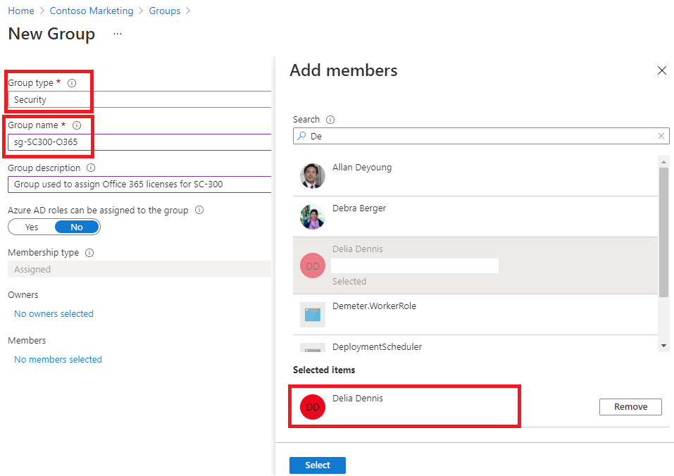

---
lab:
    title: '03 - Working with Users, Groups, and Licenses'
    module: 'Module 02 - Create, configure, and manage identities'
---

# Lab 03: Working with Users, Groups, and Licenses

## Lab scenario

Your organization has decided to use groups in Azure AD to manage users and licenses. You need to perform several operations on the users and groups withing your Azure AD, like assigning a license to a group and verify group member license's have been updated.  And adding / removing users.

#### Estimated time: 15 minutes

## Create a new user in Azure Active Directory

1. Browse to [https://portal.azure.com/#blade/Microsoft_AAD_IAM/ActiveDirectoryMenuBlade/Overview]( https://portal.azure.com/#blade/Microsoft_AAD_IAM/ActiveDirectoryMenuBlade/Overview) and sign in as a Global Administrator.

2. In the left navigation, under **Mange**, select **Users**.

3. In the Users blade, on the menu, select **New user**.

4. Create a user using the following information:

    | **Setting**| **Value**|
    | :--- | :--- |
    | User name| Chris|
    | Name| Chris Green|
    | First name| Chris|
    | Last name| Green|
    | Password| Pass@word1|

5. When complete, verify the account for Chris Green is shown in the **All users** list.

## Create a security group in Azure Active Directory

1. Browse to [https://portal.azure.com/#blade/Microsoft_AAD_IAM/ActiveDirectoryMenuBlade/Overview]( https://portal.azure.com/#blade/Microsoft_AAD_IAM/ActiveDirectoryMenuBlade/Overview).

2. In the left navigation, under **Mange**, select **Groups**.

3. In the Groups blade, on the menu, select **New group**.

4. Create a group using the following information:

    | **Setting**| **Value**|
    | :--- | :--- |
    | Group type| Security|
    | Group name| Marketing|
    | `Membership type| Assigned|
    | Owners| *Assign your own administrator account as the group owner*|
    | Members| Chris Green|

    

5. When complete, verify the group named **Marketing** is shown in the **All groups** list.

## Assign a license to a group

1. In the **All groups** list, select **Marketing**.

2. In the Marketing blade, under **Mange**, select **Licenses**.

3. On the menu, select **Assignments**.

4. In the update license assignments blade, under **Select licenses**, review the list of available licenses and then select the check box for one of the licenses.

5. Under **Review license options**, review the available options for the license you have selected.

    **Tip**

    When multiple licenses are selected, you can use the Review license options menu to select a specific license and view the license option for that license.

    

6. Select **Save**.

## Remove a user from Azure Active Directory

1. Browse to [https://portal.azure.com/#blade/Microsoft_AAD_IAM/ActiveDirectoryMenuBlade/Overview]( https://portal.azure.com/#blade/Microsoft_AAD_IAM/ActiveDirectoryMenuBlade/Overview).

2. In the left navigation, under **Manage**, select **Users**.

3. In the **Users** list, select the check box for a user that will be deleted. For example, select **Chris Green**.

    **Tip**

    Selecting users from the list allows you to manage multiple users at the same time. If you select the user, to open that user’s blade, you will only be managing that individual user.

    

4. With the user account selected, on the menu, select **Delete user**.

5. Review the dialog box and then select **OK**.

## Restore a deleted user

1. In the Users blade, in the left navigation, select **Deleted users**.

2. Review the list of deleted users and select the user you just deleted.

    **Important**

    By default, deleted user accounts are permanently removed from Azure Active Directory automatically after 30 days.

3. On the menu, select **Restore user**.

4. Review the dialog box and then select **OK**.

5. In the left navigation, select **All users**.

6. Verify the user has been restored.

## Change group license assignments

1. Browse to [https://portal.azure.com/#blade/Microsoft_AAD_IAM/ActiveDirectoryMenuBlade/Overview]( https://portal.azure.com/#blade/Microsoft_AAD_IAM/ActiveDirectoryMenuBlade/Overview).

2. In the left navigation, under **Manage**, select **Groups**.

3. Select one of the available groups. For example, Marketing.

4. In the left navigation, under **Manage**, select **Licenses**.

5. Review the current assignments and then, on the menu, select **+ Assignments**.

    

6. On the Update license assignments blade, select another license, clear the selection of an existing license, add or remove license options, or any combination.

7. When complete, select **Save**.

8. On the group’s Licenses page, review the change.
