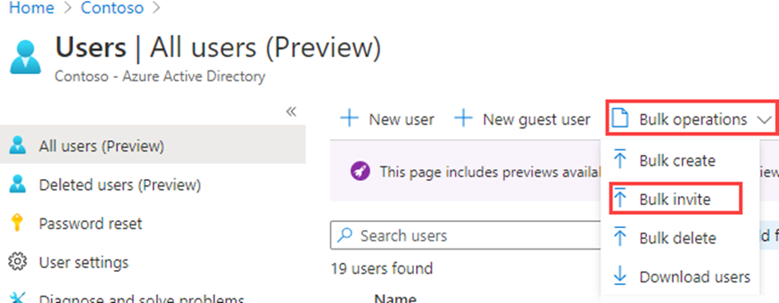

---
lab:
    title: '05 - Invite guest users in bulk'
    module: 'Module 01 - Implement an identity management solution'
---

# Lab 05: Invite guest users in bulk

# Student lab manual

## Lab scenario

A recent partnership has been established with another company. For now, employees of the partner company will be added as guests. You need to ensure you can import multiple guest users at one time.

#### Estimated time: 10 minutes

## Invite guest users in bulk

1. Sign in to the [https://portal.azure.com](https://portal.azure.com) with an account that is a User administrator in the organization.

1. In the navigation pane, select **Azure Active Directory**.

1. Under **Manage**, select **Users**.

1. On the Users blade, on the menu, select **Bulk operations > Bulk invite**.

 

1. In the Bulk invite users pane, select **Download** to a sample CSV template with invitation properties.

1. Using an editor to view the CSV file, review the template.

1. Open the .csv template and add a line for each guest user. Required values are:

    - **Email address to invite** - the user who will receive an invitation

    - **Redirection url** - the URL to which the invited user is forwarded after accepting the invitation.

    

1. Save the file.

1. On the Bulk invite users page, under **Upload your csv file**, browse to the file.

When you select the file, validation of the .csv file starts.

1. After the file contents are validated, you will see **File uploaded successfully**. If there are errors, you must fix them before you can submit the job.

    

1. When your file passes validation, select **Submit** to start the Azure bulk operation that adds the invitations.

1. To view the job status, select **Click here to view the status of each operation**. Or, you can select **Bulk operation results** in the Activity section. For details about each line item within the bulk operation, select the values under the **# Success**, **# Failure**, or **Total Requests** columns. If failures occurred, the reasons for failure will be listed.

    

1. When the job completes, you will see a notification that the bulk operation succeeded.
