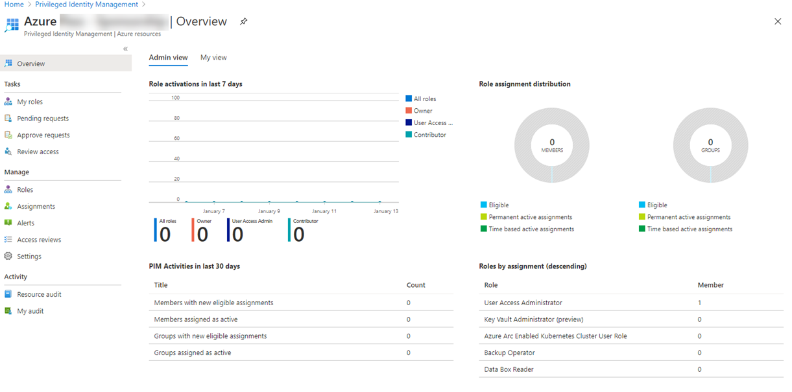

---
lab:
    title: '11 - Assign Azure resource roles in Privileged Identity Management'
    learning path: '02'
    module: 'Module 02 - Implement an authentication and access management solution'
---

# Lab 11 - Assign Azure resource roles in Privileged Identity Management

>**Note**: This lab requires an Azure Pass. Please see lab 00 for directions.

## Lab scenario

Azure Active Directory (Azure AD) Privileged Identity Management (PIM) can manage the built-in Azure resource roles, as well as custom roles, including (but not limited to):

- Owner
- User Access Administrator
- Contributor
- Security Admin
- Security Manager

You need to make a user eligible for an Azure resource role.

#### Estimated time: 10 minutes

### Exercise 1 - PIM with Azure resources

#### Task 1 - Assign Azure resource roles

1. Sign in to [https://portal.azure.com](https://portal.azure.com) using a Global Administrator account.

2. Search for and then select **Azure AD Privileged Identity Management.**

3. In the Privileged Identity Management page, in the left navigation, select **Azure resources.**

4. On the top menu, select **Discover resources**.

5. In the Azure resources – Discovery page, select your subscription and then, on the top menu, select **Manage resource**.

    

6. In the **Onboarding selected resource for management** dialog box, review the information and then select **OK**.

7. When onboarding completes, close the Azure resources – Discovery page.

8. In the Azure resources page, select the subscription.

    

9. In the left navigation menu, under **Manage**, select **Roles** to see the list of roles for Azure resources.

10. On the top menu, select + **Add assignments**.

11. In the Add assignments page, select the **Select role** menu and then select **API Management Service Contributor.**

12. Under **Select member(s),** select **No member selected**.

13. In the Select **Miriam Graham** from your organization that will be assigned the role.  Then chose **Select**.

14. Select **Next**.

15. On the **Settings** tab, under **Assignment type**, select **Eligible**.

    - **Eligible** assignments require the member of the role to perform an action to use the role. Actions might include performing a multi-factor authentication (MFA) check, providing a business justification, or requesting approval from designated approvers.

    - **Active** assignments do not require the member to perform any action to use the role. Members assigned as active have the privileges always assigned to the role.

16. Specify an assignment duration by changing the start and end dates and times.

17. When finished, select **Assign**.

18. After the new role assignment is created, a status notification is displayed.

#### Task 2 - Update or remove an existing resource role assignment

Follow these steps to update or remove an existing role assignment.

1. Open **Azure AD Privileged Identity Management**.

2. Select **Azure resources**.

3. Select the subscription you want to manage to open its overview page.

4. Under **Manage**, select **Assignments**.

5. On the **Eligible roles** tab, in the Action column, review the available options.

6. Select **Remove**.

7. In the **Remove** dialog box, review the information and then select **Yes**.
