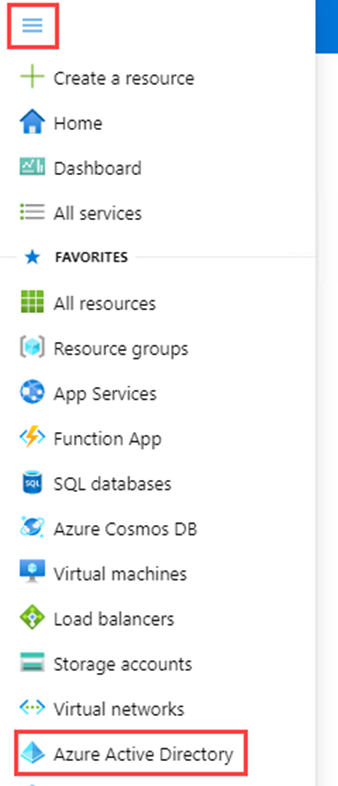
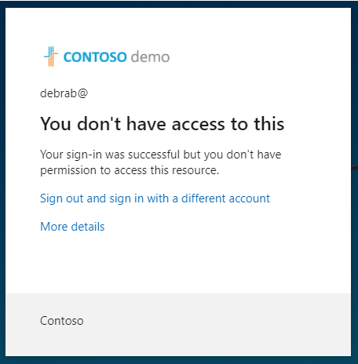

---
lab:
    title: '13 - Implement and test a conditional access policy'
    learning path: '02'
    module: 'Module 02 - Implement an Authentication and Access Management Solution'
---

# Lab 13 - Implement and test a conditional access policy

## Lab scenario

You must configure the Azure Active Directory security default settings in your organization.
    **Note**  You can turn on / off Security Defaults, just to find out where the menu option is.  But the key points to remember are from the training.  Note that if you turn on Security Defaults, and do not disable it, later labs involving Conditional Access will not work.

#### Estimated time: 30 minutes

### Exercise 1 - Disabling Security Defaults

# RobertS -- This lab cannot work; because we have created at least on Conditional Access Policy earlier.  So we either need to move it much earlier in the list of labs; and we would need to remove the default Conditional Access policy that this tenant has on Skillable.  I know this an already existing lab.  Without disabling existing conditional access polocies, turning on Security Default, going through the polocies, and then turning it back off, I don't know how much value there is.  I  had this as a lab because there are two question on the exam.

#### Task 1 - Turn off security defaults

To enable security defaults in your directory:

1. Browse to [https://portal.azure.com](https://portal.azure.com) and sign in using a Global administrator account for the directory.

1. Select the **Show portal menu** hamburger icon and then select **Azure Active Directory**.

    

1. In the left navigation, in the Manage section, select **Properties**.

1. At the bottom of the Properties blade, select **Manage Security defaults**.

1. Set the **Enable security defaults** toggle to **No**.

    

1. Select **Save**.

### Exercise 2 - Set a conditional access policy to block DebraB from accessing Yammer

#### Task 1 -- Confirm DebraB has access to Yammer

Your organization needs to be able to limit user access to its internal applications. You must deploy an Azure Active Directory conditional access policy.

1. Launch a new InPrivate browser window.
2. Connect to [https://www.office.com](https://www.office.com) 
3. When prompted, log in as DebraB:

    | Setting | Value |
    | :--- | :--- |
    | Username | **DebraB@** `<<your lab domain>>.onmicrosoft.com` |
    | Password | Enter the admin password of the tenant(Refer the Lab Resources tab to retrieve the tenant's admin password). |
    
4. Click on the Yammer icon to see that it loads correctly.

#### Task 2 -  Create a conditional access policy

Azure Active Directory conditional access is an advanced feature of Azure AD that allows you to specify detailed policies that control who can access your resources. Using Conditional Access, you can protect your applications by limiting users' access based on things like groups, device type, location, and role.

1. Browse to [https://portal.azure.com](https://portal.azure.com) and sign in using a Global administrator account for the directory.

2. Open the portal menu and then select **Azure Active Directory**.

3. On the Azure Active Directory blade, under **Manage**, select **Security**.

4. On the Security blade, in the left navigation, select **Conditional access**.

5. On the top menu, select **+ New policy** from the drop-down select **Create a new policy**.

    

6. In the **Name** box, enter **Block Yammer for DebraB**.

    **Note** - Using this naming to help you quickly recognize the policy and its function.

7. Under **Assignments**, select **Users or workload identities**.

8. On the Include tab, select the **Users and groups** check box.

9. In the Select pane, select **DebraB** account and then select **Select**.

10. Select **Cloud apps or actions**.

11. Verify **Cloud apps** is selected and then select **Select apps**.

12. In the Select pane, search for **Yammer** and select **Office 365 Yammer** and then select **Select**.

13. Under **Access controls**, select **Grant**.

14. In the Grant pane, select **Block access** and then select **Select**.

    **Note** - This policy is being configure for the exercise only and is being used to quickly demonstrate a conditional access policy.

15. Under **Enable policy**, select **On**, and then select **Create**.

    

#### Task 3 - Test the conditional access policy

You should test your conditional access policies to ensure they working as expected.

1. Open a new 'Inprivate' browser tab and then browse to [https://www.yammer.com/office365](https://www.yammer.com/office365).
     - When prompted, log in as DebraB:

    | Setting | Value |
    | :--- | :--- |
    | Username | **DebraB@** `<<your lab domain>>.onmicrosoft.com` |
    | Password | Enter the admin password of the tenant(Refer the Lab Resources tab to retrieve the tenant's admin password). |
      
2. Verify you are prevented from successfully access Microsoft Yammer.

    

3. If you are signed in, close the tab, wait 1 minute, and then retry.
    
     **Note** - If your are auto-logged into Yammer as DebraB, then you will need to manually log out.  You credentials / access were cached.  Once you log out and sign-in, your Yammer session should deny access.

4. Close the tab and return to the Conditional Access blade.

5. Select the **Yammer conditional access** policy.

6. Under **Enable policy**, select **Off** and then select **Save**.

### Exercise 3 - Test conditional access policies with "What if"

#### Task - Use What if to test conditional access policies

1. Open the portal menu and then select **Azure Active Directory**.

1. On the Azure Active Directory blade, under **Manage**, select **Security**.

1. On the Security blade, in the left navigation, select **Conditional access**.

1. Select **What if**.

1. Under **User or Workload identity**, select **No user or service principal selected**.

1. Choose **DebraB** as the user.

1. Under **Cloud apps, actions, or authentication context**, select **Yammer**. 

1. Select **What if**. You will be provided with a report at the bottom of the tile for **Policies that will apply** and **Policies that will not apply**.

This allows you to test the policies and their affectiveness before enabling the policies.

### Exercise 4 - Configure sign in frequency controls using a conditional access policy

#### Task - User the Azure Portal to configure conditional access

As part of your company's larger security configuration, you must test a conditional access policy that can be used to control sign in frequency

1. Browse to [https://portal.azure.com](https://portal.azure.com) and sign in using a Global administrator account for the directory.

2. Open the portal menu and then select **Azure Active Directory**.

3. On the Azure Active Directory blade, under **Manage**, select **Security**.

4. On the Security blade, in the left navigation, select **Conditional access**.

5. On the top menu, select **+ New policy** from the drop-down select **Create a new policy**.

    

6. In the **Name** box, enter **Sign in frequency**.

7. Under **Assignments**, select **Users or workload identities**.

8. On the Include tab, select the **Users and groups** check box.

9. In the Select pane, select your **Grady Archie** account and then select **Select**.

10. Select **Cloud apps or actions**.

11. Verify **Cloud apps** is selected and then select **Select apps**.

12. In the Select pane, select **Office 365** and then select **Select**.

13. Under **Access controls**, select **Session**.

14. In the Session pane, select **Sign-in frequency**.

15. In the value box, enter **30**.

16. Select the units menu, select **Days**, and then select **Select**.

17. Under **Enable policy**, select **Report-only**, and then select **Create**.

    

   **NOTE** - Report-only mode is a new Conditional Access policy state that allows administrators to evaluate the impact of Conditional Access policies before enabling them in their environment. With the release of report-only mode:
    
- Conditional Access policies can be enabled in report-only mode.
- During sign-in, policies in report-only mode are evaluated but not enforced.
- Results are logged in the Conditional Access and Report-only tabs of the Sign-in log details.
- Customers with an Azure Monitor subscription can monitor the impact of their Conditional Access policies using the Conditional Access insights workbook.
