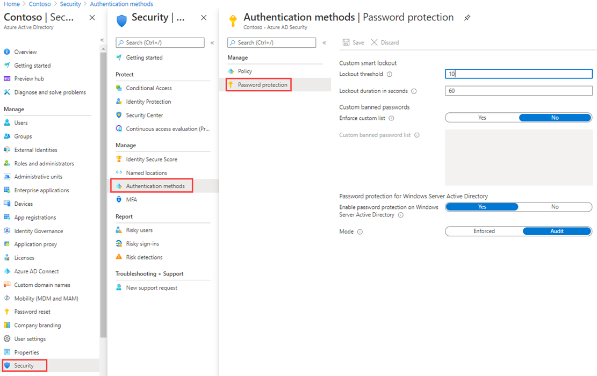

---
lab:
    title: '17 - Manage Azure AD smart lockout values'
    learning path: '02'
    module: 'Module 03 -Plan, implement, and administer conditional access'
---

# Lab 17 - Manage Azure AD smart lockout values

## Lab scenario

You must configure the additional password protection settings for your organization.

#### Estimated time: 5 minutes

## Manage Azure AD smart lockout values

Based on your organizational requirements, you can customize the Azure AD smart lockout values. Customization of the smart lockout settings, with values specific to your organization, requires Azure AD Premium P1 or higher licenses for your users.

1. Browse to [https://portal.azure.com](https://portal.azure.com) and sign in using a Global administrator account for the directory.

1. Open the portal menu and then select **Azure Active Directory**.

1. On the Azure Active Directory blade, under **Manage**, select **Security**.

1. On the Security blade, in the left navigation, select **Authentication methods**.

1. In the left navigation, select **Password protection**.

    

1. In the Password protection settings, in the **Lockout duration in seconds** box, set the value to **120**.

1. Next to **Mode**, select **Enforced**.

1. Save your changes.

    **NOTE** - When the smart lockout threshold is triggered, you will get the following message while the account is locked:
    - Your account is temporarily locked to prevent unauthorized use. Try again later, and if you still have trouble, contact your admin.
